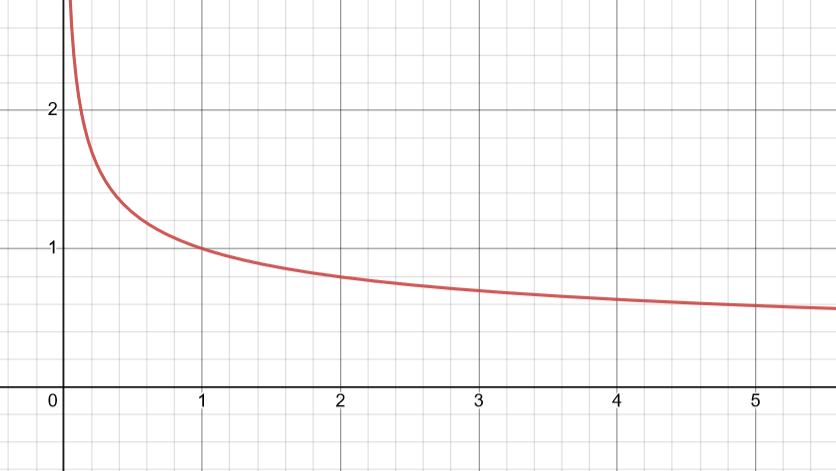

# 针对Sidecar模式下的服务网格数据面应用服务访问QPS和延时的优化

本赛题的目标是提升服务网格的整体性能, 具体的来说就是平均时延/资源节约率/QPS.

赛题有两个用来量化性能的指标:
 
1. 性能分数: 衡量服务网格的性能指标. 主要体现 $t$ 轮测试中的平均时延和QPS.

    $Point_{performence}=\Large \frac{\sum_{\frac{QPS_i}{T_i}}}{t}$
    
    
    $T_{i}$ : 第 $i$ 轮测试中的平均时延,计算发往入口网关的所有请求的时延之均值. 设测试过程中共有 $n$ 条发往入口网关的请求, 对于第 $j$ 条发往入口网关的请求, 设其时延为 $L_{j}$ , 则平均时延为 $\Large T_{i}=\frac{\sum_{L_j}}{n}$

    $QPS_{i}$ : 第 $i$ 轮测试的QPS.

2. 资源分数: 衡量服务网格的资源节约程度, 资源有CPU和内存两项.

    $Point_{resource}=min(R_{CPU}*R_{memory},Resource_{max})$

    $Resource_{max}$ 为系统规定的此项分数的上限, $R_{CPU}$ 和 $R_{memory}$ 分别为CPU和内存的使用率.

就如同赛题里所说的, 我们的优化手段主要有三点:
1. 合理分配Sidecar的资源
2. 平台特性调优
3. Sidecar配置调优

接下来我们具体分析这三点内容.

## 合理分配Sidecar的资源

这可以说是本赛题的重中之重, 直接影响到性能分数和资源分数.

我们的解法分为以下几个步骤:

1. 赛题规定每个sidecar最低需要分配最低的 $0.1c+128m$ 的资源, 所以在一开始我们可以给所有sidecar分配上最低限度的资源, 然后再去考虑如何分配剩余资源.
2. 资源率使用越低越好, 我们将使用剩余资源中70%的cpu和0%的内存, 以拉高资源分数, 这个比例能达到系统资源分数的上限.
3. 由于资源划分是按service为单位的, 也就是说同一个service中的sidecar都会被分配到同样多的资源. 所以我们通过某种计算方式得到一个service的权重, 然后根据权重去分配资源.

    具体的来说, 我们设一个含有 $Size_{i}$ 个sidecar的服务 $Service_{i}$ 的权重为 $P_{i}$ , 那么每个sidecar分配到的资源比例为:

     $\Large Resource_{x} = \frac{P_{x}}{\sum_{i}{P_{i}}} \times Resource \times \frac{1}{Size_{x}}$

4. 基于一些比较朴素的思想, 权重我们主要参考了服务中机器收发request的个数和服务中含有的sidecar的个数. 
    
    1. 如果一个服务 $Service_{i}$ 中收发请求数量 $Request_{i}$ 很多, 那么显然我们应该给予更多的资源.

    2. 如果一个服务 $Service_{i}$ 中sidecar的数量 $Size_{i}$ 很多, 那么平均分配之下很可能有一些资源错配的情况, 在这种情况下我们应该给予更少的资源以避免资源浪费.

    最终我们得到 $Service_{i}$ 的权重为: $\Large P_{i}=\frac{Request_{i}}{Size_{i}^{0.33}}$

    这里 $Size_{i}$ 对于 $P_{i}$ 的影响公式取的是 $\Large f(x)=\frac{1}{x^{0.33}}$ , 可能跟实际参赛时提交的参数有出入(因为没有确切记下最高分时的参数), 实际上一些类似函数曲线总体效果都差不多，例如把0.33改为 $[0.3,0.5]$ 之间的一些其他数字，或者取一些 $log$ 函数.

    

## 平台特性调优
平台特性主要是multi-buffer,可以调整的参数有是否开启和pollDelay值的大小, 我们对这个了解的不多, 做了一些尝试后认为将pollDelay调小到0.1以内或者直接关闭对分数比较有利.

## Sidecar配置调优
同样由于我们其实没有istio的实际使用经验, 只能凭借一些资料查阅和实际测试.

最后发现似乎将`proxy.istio.io/config: 'concurrency'`稍微调大会有一些正面作用, 例如调到 $[2, 4]$ .

# 总结
因为欠缺对istio的了解, 所以我们只能把系统当成一个黑盒. 主要把功夫下在资源分配的策略上, 凭借一些贪心策略去构建一个分配资源的模型. 重点在于最低限度使用资源的同时, 根据找到的一些衡量sidecar权重的指标合理分配资源.

实际上赛题中还提供了很多其他信息和数据(例如请求大小, 上一轮的CPU/内存使用量等), 但是我们在经过一些尝试和测试后并没能在其中发现一些能显著对结果有正面相关性的指标(或者并不显著的比目前选择的两个指标更好), 所以最后主要还是只通过请求数量和sidecar数量来分配资源.
